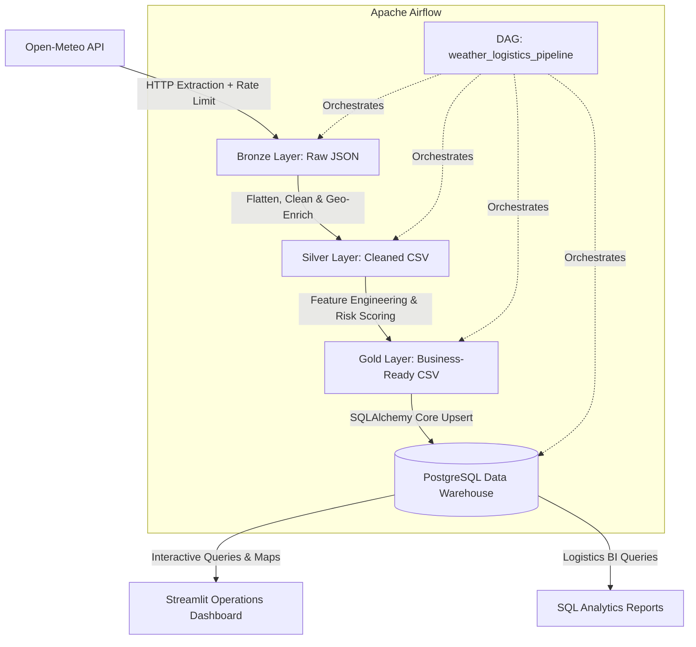

  # 🚚 Weather-Driven Logistics Data Pipeline & Operations Intelligence

[](https://www.python.org/)
[](https://www.postgresql.org/)
[](https://airflow.apache.org/)
[](https://www.docker.com/)
[](https://streamlit.io/)
[](https://plotly.com/)

An end-to-end data engineering pipeline and operations platform designed to assess and mitigate weather-induced supply chain and freight transit risks across major logistics hubs in Morocco. 

The platform extracts multi-variable forecasts from the **Open-Meteo API**, processes data through a structured **Medallion Architecture (Bronze $\rightarrow$ Silver $\rightarrow$ Gold)**, computes predictive **Weather Risk Scores**, loads historical and forecasted data into **PostgreSQL**, orchestrates automated daily workflows via **Apache Airflow**, and provides an interactive operations dispatch cockpit built with **Streamlit**.

---

## 📑 Table of Contents
1. [Architecture Overview](#-architecture-overview)
2. [Medallion Data Pipeline](#-medallion-data-pipeline)
3. [Risk Scoring & Feature Engineering](#-risk-scoring--feature-engineering)
4. [Database Schema & ERD](#-database-schema--erd)
5. [Repository Structure](#-repository-structure)
6. [Quickstart & Installation](#-quickstart--installation)
7. [Services & Access Points](#-services--access-points)
8. [Airflow Workflow Orchestration](#-airflow-workflow-orchestration)
9. [SQL Analytics & Business Intelligence](#-sql-analytics--business-intelligence)
10. [Streamlit Operations Dashboard](#-streamlit-operations-dashboard)

---

## 🏗 Architecture Overview



---

## 🏅 Medallion Data Pipeline

The pipeline adheres to the Databricks Medallion Architecture principles:

* **🥉 Bronze Layer (`data/bronze/`)**:
  * Ingests 7-day weather forecast arrays (max/min temperatures, precipitation sum, probability, wind speed, wind gusts) for Moroccan commercial hubs (Casablanca, Tangier, Fès, Marrakech, Agadir).
  * Implements rate-limiting pauses to comply with API quotas.
  * Files saved as: `weather_for_YYYYMMDD.json`.

* **🥈 Silver Layer (`data/silver/`)**:
  * Flattens nested JSON payloads into tabular formats using Pandas.
  * Standardizes date formats and casts columns to strongly typed numerical representations.
  * Drops corrupt/empty records and deduplicates forecasts by `(city, date)`.
  * Enriches weather records with municipal coordinates and administrative region data from `moroccan_cites.csv`.
  * Files saved as: `weather_cleaned_YYYYMMDD.csv`.

* **🥇 Gold Layer (`data/gold/`)**:
  * Generates business-ready variables and rule-based risk indicators.
  * Calculates composite **Weather Risk Scores (0–100)** and risk levels (`Low`, `Medium`, `High`).
  * Classifies temperature, wind, and precipitation into actionable categorical tiers (`Cold`, `Moderate`, `Hot`, `Extreme Heat`, `Dry`, `Heavy Rain`, `Stormy`).
  * Files saved as: `weather_gold_YYYYMMDD.csv`.

---

## 🧮 Risk Scoring & Feature Engineering

To aid logistics dispatchers in risk mitigation, the gold layer applies a domain-tailored risk scoring heuristic:

$$\text{Risk Score} = \min(100, S_{\text{precip}} + S_{\text{wind}} + S_{\text{temp}})$$

### Breakdown:
| Hazard Variable | Condition | Risk Points Added | Logistics Impact |
| :--- | :--- | :---: | :--- |
| **Precipitation** | $> 15\text{ mm}$ | **+40** | Flooding, severe hydroplaning, braking failure |
| | $> 5\text{ mm}$ | **+20** | Wet pavement, reduced transit speed |
| | $> 0\text{ mm}$ | **+10** | Light rain conditions |
| **Wind Gusts** | $> 60\text{ km/h}$ | **+30** | Critical rollover hazard for high-profile trailers |
| | $> 40\text{ km/h}$ | **+15** | Heavy crosswinds, speed reduction required |
| **Temperature** | $\ge 40^\circ\text{C}$ or $\le 0^\circ\text{C}$ | **+30** | Severe reefer cooling strain / road icing hazard |
| | $\ge 35^\circ\text{C}$ or $\le 5^\circ\text{C}$ | **+15** | Mandatory refrigerated transport (cold-chain) |

### Risk Categorization:
* 🟢 **Low Risk (0–44)**: Safe operating conditions. Green-flag transit.
* 🟡 **Medium Risk (45–64)**: Caution advised. Speed reduction and payload check.
* 🔴 **High Risk (65–100)**: Hazardous route. Dispatch hold or route diversion recommended.

---

## 🗄 Database Schema & ERD

The relational data model is stored in PostgreSQL and documented in `docs/UML/weather logistics ERD.png`:

```
+------------------------------------+          +------------------------------------+
|               cities               |          |         weather_forecasts          |
+------------------------------------+          +------------------------------------+
| PK  name         VARCHAR           |<---1:N---| PK  id               INTEGER (AUTO) |
|     lat          FLOAT             |          | FK  city_name        VARCHAR        |
|     lng          FLOAT             |          |     date             DATE           |
|     admin_name   VARCHAR           |          |     temp_max         FLOAT          |
|     population   FLOAT             |          |     temp_min         FLOAT          |
+------------------------------------+          |     precip_sum       FLOAT          |
                                                |     wind_gusts       FLOAT          |
                                                |     risk_score       INTEGER        |
                                                |     risk_level       VARCHAR        |
                                                |     temp_category    VARCHAR        |
                                                |     precip_category  VARCHAR        |
                                                |     wind_category    VARCHAR        |
                                                |     updated_at       TIMESTAMP      |
                                                +------------------------------------+
                                                | UQ  (city_name, date)               |
                                                +------------------------------------+
```

* **Idempotent Loading**: The loading script implements PostgreSQL upserts via `ON CONFLICT (city_name, date) DO UPDATE`, preventing duplicate rows across repeated runs.

---

## 📂 Repository Structure

```text
weather_logistics_pipeline/
├── dags/                                 # Apache Airflow orchestration
│   └── weather_pipeline_dag.py           # Daily automated ETL DAG definition
├── dashboard/                            # Streamlit Operations Cockpit
│   └── app.py                            # Interactive GIS map & analytics UI
├── data/                                 # Medallion Data Store
│   ├── bronze/                           # Raw Open-Meteo JSON extracts & cities seed
│   ├── silver/                           # Cleaned & joined CSV datasets
│   └── gold/                             # Engineered features & risk score datasets
├── docs/                                 # Architecture & design documentation
│   └── UML/                              # Entity Relationship Diagrams (PDF & PNG)
├── sql/                                  # Business Intelligence & analytics queries
│   ├── highest_risk.sql                  # Critical risk score route query
│   ├── highest_temperature.sql           # Extreme heat tracking for cold-chain
│   ├── highest_wind_gusts.sql            # Rollover hazard analysis
│   ├── risk_score_by_period.sql          # Timeline aggregate analysis
│   └── risk_score_by_period_city.sql     # Hub-level risk breakdown
├── src/                                  # Core Pipeline Source Code
│   ├── extraction/
│   │   └── fetch_weather.py              # Open-Meteo REST API extractor
│   ├── transformation/
│   │   ├── clean_data.py                 # Silver cleaning & geo-enrichment
│   │   └── build_features.py             # Gold feature engineering & risk logic
│   └── load/
│       └── load_to_pg.py                 # Database upsert loader (SQLAlchemy)
├── docker-compose.yml                    # Multi-container stack (Postgres, pgAdmin, Airflow)
├── .gitignore                            # Environment and cache ignore rules
└── README.md                             # Project documentation
```

---

## 🚀 Quickstart & Installation

### 1. Clone Repository & Create Virtual Environment
```bash
git clone https://github.com/lioubiarabi/weather_logistics_pipeline.git
cd weather_logistics_pipeline

# Create and activate virtual environment
python -m venv .venv
# On Windows:
.venv\Scripts\activate
# On Linux/macOS:
source .venv/bin/activate

# Install dependencies
pip install pandas psycopg2-binary sqlalchemy requests streamlit plotly
```

### 2. Start Infrastructure via Docker Compose
Launch PostgreSQL, pgAdmin 4, and Apache Airflow with a single command:
```bash
docker-compose up -d
```

---

## 🌐 Services & Access Points

| Service | Port (Host) | Web URL | Credentials |
| :--- | :---: | :---: | :--- |
| **PostgreSQL Database** | `5433` (mapped to `5432`) | `localhost:5433` | User: `postgres` / Pass: `admin` / DB: `weather_logistics` |
| **pgAdmin 4 Web UI** | `5050` | [http://localhost:5050](http://localhost:5050) | Email: `admin@admin.com` / Pass: `admin` |
| **Apache Airflow** | `8080` | [http://localhost:8080](http://localhost:8080) | User: `admin` / Pass: `admin` |
| **Streamlit Dashboard** | `8501` | [http://localhost:8501](http://localhost:8501) | *No authentication required* |

---

## 🔄 Airflow Workflow Orchestration

The daily DAG (`weather_logistics_pipeline`) is scheduled to execute every morning at **09:00 UTC** (`0 9 * * *`):

1. **`fetch_bronze_layer`**: Queries Open-Meteo API and dumps fresh raw JSON files.
2. **`clean_silver_layer`**: Parses, cleans, and merges coordinates into the Silver layer.
3. **`build_gold_layer`**: Generates operational categories and risk scores.
4. **`load_postgres`**: Performs idempotent SQL upserts into PostgreSQL.

To trigger the DAG manually:
1. Open [http://localhost:8080](http://localhost:8080).
2. Unpause the `weather_logistics_pipeline` toggle.
3. Click the **Trigger DAG** (Play) button.

---

## 📊 SQL Analytics & Business Intelligence

The `sql/` directory contains targeted analytical queries for logistics decision-makers:

* **`highest_risk.sql`**: Identifies cities with peak composite weather hazard scores to coordinate rerouting.
* **`highest_wind_gusts.sql`**: Flags highway segments subject to crosswinds $>60\text{ km/h}$ for empty trailer rollover prevention.
* **`highest_temperature.sql`**: Detects extreme ambient heat ($\ge 35^\circ\text{C}$) to activate reefer transport and preserve perishables/pharmaceuticals.
* **`risk_score_by_period.sql`**: Analyzes multi-day risk trends across forecast horizons.
* **`risk_score_by_period_city.sql`**: Ranks regional hubs by average expected risk index.

---

## 🖥️ Streamlit Operations Dashboard

Launch the interactive operations dashboard:
```bash
streamlit run dashboard/app.py
```

### Dashboard Capabilities:
* **Interactive GIS Map of Morocco**: Plots transit hubs with bubble sizes scaled to weather risk scores, colored by hazard severity.
* **Time-Series Metric Trends**: Compares temperature, wind gusts, and precipitation over the 7-day forecast across hubs.
* **Dispatcher Warnings Panel**:
  * 💨 *Wind & Rollover Hazards* (wind gusts $\ge 50\text{ km/h}$).
  * 🌡️ *Cold-Chain Quality Assurance* (temperatures $\ge 35^\circ\text{C}$).
  * 🌧️ *Hydroplaning Warnings* (precipitation $> 5\text{ mm}$).
  * 🟢 *Safe Delivery Windows* (dry roads, calm wind, low risk).
* **Data Explorer**: Comprehensive filterable data grid with one-click **CSV Export**.

---

## 👤 Author
* **Arabi Lioubi** - [GitHub Profile](https://github.com/lioubiarabi)
